# LangGraph SOC Triage & Orchestration Framework (AegisGraph)

**A next-generation framework to revolutionize Security Operations Centers (SOCs) by intelligently automating alert triage, reducing false positives, and eliminating log fatigue using LangGraph's multi-agent orchestration.**

## 🌟 Vision

Security Operations Centers are drowning in alerts. Analysts waste countless hours investigating false positives while critical threats get lost in the noise. LG-SOTF aims to transform SOC operations by:

- **Reducing alert fatigue** by 70%+ through intelligent automation
- **Slashing false positive rates** from 30-40% to under 15%
- **Cutting mean time to respond** from hours to minutes
- **Empowering analysts** to focus on genuine threats instead of noise

## 🎯 Why This Project Matters

### The SOC Crisis
- **Alert Overload**: 10,000+ alerts per day in typical enterprises
- **False Positives**: 30-40% of alerts are false positives, wasting analyst time
- **Analyst Burnout**: 65% of SOC analysts report symptoms of burnout
- **Missed Threats**: Critical alerts get buried in the noise

### Our Solution
LG-SOTF leverages LangGraph's stateful multi-agent architecture to create an intelligent alert processing pipeline that:
1. **Automatically triages** alerts using rule-based and AI-powered analysis
2. **Enriches context** by correlating events across systems
3. **Performs deep analysis** using dynamic tool orchestration (ReAct pattern)
4. **Learns continuously** from human feedback to improve accuracy
5. **Escalates only high-value alerts** with full context to analysts

## 🚀 What We're Building

### Core Architecture

```mermaid
graph TD
    State[<b>State Object</b><br/>• raw_alert<br/>• enriched_data<br/>• triage_status<br/>• confidence_score<br/>• FP/TP_indicators<br/>• human_feedback]
    
    Ingestion[<b>Ingestion Agent</b>]
    Triage[<b>Triage Agent</b>]
    Correlation[<b>Correlation Agent</b>]
    Analysis[<b>Analysis Agent</b><br/>ReAct Loop]
    HumanLoop[<b>Human-in-the-Loop</b>]
    Response[<b>Response Agent</b>]
    Learning[<b>Learning Agent</b>]
    
    Ingestion --> State --> Triage --> State --> Correlation --> State --> Analysis --> State --> HumanLoop --> State --> Response --> State --> Learning --> State --> Close[<b>Close Alert</b>]
```

### Key Features
- **Multi-Agent Orchestration**: Specialized agents for each processing stage
- **Intelligent Decision Points**: Context-aware routing based on confidence scores
- **ReAct-Powered Analysis**: Dynamic tool usage with Reason→Act→Observe cycles
- **Human-AI Collaboration**: Seamless escalation with full context capture
- **Continuous Learning**: Reduces FPs over time through feedback integration
- **Modular Tool Integration**: Connectors for all major security tools

## 🛠 Technology Stack

- **Core Framework**: LangGraph for stateful multi-agent workflows
- **AI Models**: OpenAI GPT-4, Anthropic Claude, or open-source alternatives
- **Data Processing**: Pandas, NumPy for log analysis
- **Security Tools**: Splunk, QRadar, CrowdStrike, VirusTotal, etc.
- **Vector DB**: Chroma/Pinecone for similarity search
- **Containerization**: Docker for deployment
- **Testing**: pytest for comprehensive testing

## 🤝 How to Contribute

We're looking for contributors passionate about:
- AI/ML in cybersecurity
- Security operations automation
- Multi-agent systems
- Open-source development

### Getting Started
1. **Star the repository** ⭐ to show your interest
2. **Join our community**:
   - Discord: [Link to Discord server]
   - Discussions: [GitHub Discussions]
3. **Check our roadmap** and pick an area that interests you
4. **Read the Contributing Guide** (coming soon)

### Areas for Contribution
- **Agent Development**: Build specialized agents for new use cases
- **Tool Integration**: Add connectors for security tools
- **AI Models**: Improve LLM prompts and fine-tuning
- **UI/UX**: Create dashboards for analyst interaction
- **Testing**: Write comprehensive test suites
- **Documentation**: Improve guides and examples
- **Performance**: Optimize for high-volume environments

## 🗺 Roadmap

### Phase 1: Foundation (Q1 2024)
- [ ] Core state management system
- [ ] Ingestion and Triage agents
- [ ] Basic SIEM integration
- [ ] Initial decision logic

### Phase 2: Intelligence (Q2 2024)
- [ ] Correlation agent with historical analysis
- [ ] Analysis agent with ReAct loop
- [ ] Threat intelligence integration
- [ ] Human-in-the-loop system

### Phase 3: Automation (Q3 2024)
- [ ] Response agent with EDR integration
- [ ] Learning agent with feedback loop
- [ ] Performance optimization
- [ ] Comprehensive testing

### Phase 4: Production (Q4 2024)
- [ ] Deployment guides
- [ ] Monitoring and observability
- [ ] Advanced UI components
- [ ] Enterprise features

## 📜 License

This project is licensed under the MIT License - see the [LICENSE](LICENSE) file for details.

## 🙏 Acknowledgments

- [LangChain](https://github.com/langchain-ai/langchain) for the powerful LangGraph framework
- Security operations teams worldwide for their invaluable feedback
- Open-source security tools that make this integration possible

## 📞 Contact

- **Project Maintainers**: [Gapilongo]
- **Email**: [nibniw@gmail.com]

---

**Note**: This is an active project in early development. We welcome all contributions and feedback. Together, we can transform how security operations centers work and make the digital world a safer place.